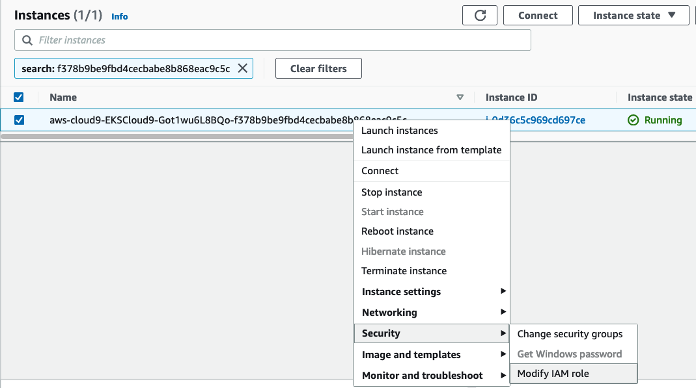
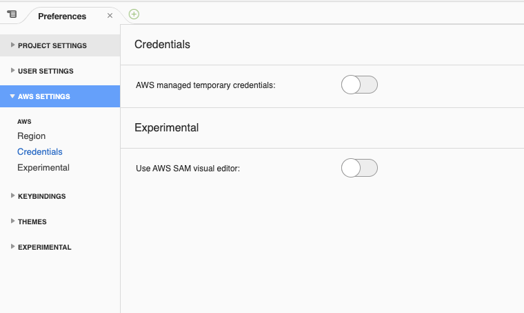
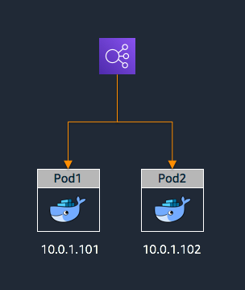

## Deploy and Expose Game 2048 on EKS Fargate using an Appplication Load Balancer
This lab is provided as part of **[AWS Innovate Modern Applications Edition](https://aws.amazon.com/events/aws-innovate/apj/modern-apps/)**. 

Click [here](https://github.com/phonghuule/aws-innovate-modern-applications-2022) to explore the full list of hands-on labs.

ℹ️ You will run this lab in your own AWS account. Please follow directions at the end of the lab to remove resources to avoid future costs.

### About this lab

[Kubernetes Ingress](https://kubernetes.io/docs/concepts/services-networking/ingress/) is an API resource that allows you manage external or internal HTTP(S) access to Kubernetes services running in a cluster. 

[AWS Load Balancer Controller](https://github.com/kubernetes-sigs/aws-load-balancer-controller) is a controller to help manage Elastic Load Balancers for a Kubernetes cluster. The controller enables you to simplify operations and save costs by sharing an Application Load Balancer across multiple applications in your Kubernetes cluster, as well as using a Network Load Balancer to target pods running on AWS Fargate. 
    - It satisfies Kubernetes Ingress resources by provisioning Application Load Balancers.
    - It satisfies Kubernetes Service resources by provisioning Network Load Balancers.

[AWS Fargate](https://docs.aws.amazon.com/eks/latest/userguide/fargate.html) is a technology that provides on-demand, right-sized compute capacity for containers. With AWS Fargate, you no longer have to provision, configure, or scale groups of virtual machines to run containers. This removes the need to choose server types, decide when to scale your node groups, or optimize cluster packing. You can control which pods start on Fargate and how they run with Fargate profiles, which are defined as part of your Amazon EKS cluster.

In this lab, we will deploy the game [2048 game](http://play2048.co/) on EKS Fargate and expose it to the Internet using an Application Load balancer.

### How Kubernetes Ingress works with [](https://github.com/kubernetes-sigs/aws-alb-ingress-controller)

The following diagram details the AWS components that the aws-alb-ingress-controller creates whenever an Ingress resource is defined by the user. The Ingress resource routes ingress traffic from the Application Load Balancer(ALB) to the Kubernetes cluster.


## Setup

### Step 1 - Create Cloud9 environment via AWS CloudFormation

1. Log in your AWS Account
1. Click [this link](https://console.aws.amazon.com/cloudformation/home?region=us-east-1#/stacks/new?stackName=EKS-ALB-2048-Game&templateURL=https://aws-innovate-modern-applications.s3.amazonaws.com/eks-2048-game/cloud9.yaml) and open a new browser tab
1. Click *Next* again to the stack review page, tick **I acknowledge that AWS CloudFormation might create IAM resources** box and click *Create stack*.
  
  

4. Wait for a few minutes for stack creation to complete.
5. Select the stack and note down the outputs (*Cloud9EnvironmentId* & *InstanceProfile*) on *outputs* tab for next step.

  

### Step 2 - Assign instance role to Cloud9 instance

1. Launch [AWS EC2 Console](https://console.aws.amazon.com/ec2/v2/home?#Instances).
2. Use stack output value of *Cloud9EnvironmentId* as filter to find the Cloud9 instance.

  

3. Right click the instance, *Security* -> *Modify IAM Role*.
4. Choose the profile name matches to the *InstanceProfile* value from the stack output, and click *Apply*.

  

### Step 3 - Disable Cloud9 Managed Credentials

1. Launch [AWS Cloud9 Console](https://console.aws.amazon.com/cloud9/home?region=us-east-1#)
1. Locate the Cloud9 environment created for this lab and click "Open IDE". The environment title should start with *EKSCloud9*.
1. At top menu of Cloud9 IDE, click *AWS Cloud9* and choose *Preferences*.
1. At left menu *AWS SETTINGS*, click *Credentials*.
1. Disable AWS managed temporary credentials:

  

### Step 4 - Bootstrap lab environment on Cloud9 IDE

Run commands below on Cloud9 Terminal to clone this lab repository and bootstrap the lab:

```
git clone https://github.com/phonghuule/eks-2048-game.git
cd eks-2048-game/setup
./bootstrap.sh
```

The *bootstrap.sh* script will:

- Upgrade AWS CLI to latest version.
- Install kubectl, [eksctl](https://eksctl.io/).
- Create an EKS cluster named **eks-alb-2048game** with eksctl.
- Set up [IAM roles for service accounts](https://docs.aws.amazon.com/eks/latest/userguide/iam-roles-for-service-accounts.html) for the Load Balancer Controller.
- Install [Helm](https://helm.sh/)

  

Note: If the script is stuck at creating SSH Key Pair, please hit enter, the script will continue

## Lab

### Step 0

In Cloud 9 environment, maximize the Terminal, and load the profile with this command:

```
source ~/.bash_profile
```

### Step 1

The [Fargate profile](https://docs.aws.amazon.com/eks/latest/userguide/fargate-profile.html) allows an administrator to declare which pods run on Fargate. Each profile can have up to five selectors that contain a namespace and optional labels. You must define a namespace for every selector. The label field consists of multiple optional key-value pairs. Pods that match a selector (by matching a namespace for the selector and all of the labels specified in the selector) are scheduled on Fargate.

It is generally a good practice to deploy user application workloads into namespaces other than **kube-system** or **default** so that you have more fine-grained capabilities to manage the interaction between your pods deployed on to EKS. 

You will now create a new Fargate profile named **game-2048** that targets all pods destined for the **game-2048** namespace.

```
eksctl create fargateprofile \
  --cluster eks-alb-2048game \
  --name game-2048 \
  --namespace game-2048
```

Creation of a Fargate profile can take up to several minutes. Execute the following command after the profile creation is completed and you should see output similar to what is shown below.
```
eksctl get fargateprofile \
  --cluster eks-alb-2048game \
  -o yaml
```
Expected Output: 
```
- name: game-2048
  podExecutionRoleARN: arn:aws:iam::197520326489:role/eksctl-eksworkshop-eksctl-FargatePodExecutionRole-1NOQE05JKQEED
  selectors:
  - namespace: game-2048
  subnets:
  - subnet-02783ce3799e77b0b
  - subnet-0aa755ffdf08aa58f
  - subnet-0c6a156cf3d523597
```

Pods running on Fargate are not assigned public IP addresses, so only private subnets (with no direct route to an Internet Gateway) are supported when you create a Fargate profile. Hence, while provisioning an EKS cluster, you must make sure that the VPC that you create contains one or more private subnets. When you create an EKS cluster with eksctl utility, under the hoods it creates a VPC that meets these requirements.

### Step 2
Install the AWS Load Balancer Controller using Helm

To add the Amazon EKS chart repo to Helm, run this command:
```
helm repo add eks https://aws.github.io/eks-charts
```

To install the TargetGroupBinding custom resource definitions (CRDs), run this command:
```
kubectl apply -k "github.com/aws/eks-charts/stable/aws-load-balancer-controller//crds?ref=master"
```

Get **vpcID** of EKS Cluster **eks-alb-2048game** created by the bootstrap.sh script by running:
```
aws eks describe-cluster --name eks-alb-2048game
```

Replace the **<VPC_ID>** with the **vpcID** value and run the command below to install the Helm chart:
```
helm install aws-load-balancer-controller eks/aws-load-balancer-controller \
    --set clusterName=eks-alb-2048game \
    --set serviceAccount.create=false \
    --set region=us-east-1 \
    --set vpcId=<VPC_ID> \
    --set serviceAccount.name=aws-load-balancer-controller \
    -n kube-system
```

### Step 3
Deploy the game [2048](https://play2048.co/) as a sample application to verify that the AWS Load Balancer Controller creates an Application Load Balancer as a result of the Ingress object.

```
kubectl apply -f https://raw.githubusercontent.com/kubernetes-sigs/aws-load-balancer-controller/main/docs/examples/2048/2048_full.yaml

```

You can check if the deployment has completed:
```
kubectl -n game-2048 rollout status deployment deployment-2048
```

Expected Output:
```
Waiting for deployment "deployment-2048" rollout to finish: 0 of 5 updated replicas are available...
Waiting for deployment "deployment-2048" rollout to finish: 1 of 5 updated replicas are available...
Waiting for deployment "deployment-2048" rollout to finish: 2 of 5 updated replicas are available...
Waiting for deployment "deployment-2048" rollout to finish: 3 of 5 updated replicas are available...
Waiting for deployment "deployment-2048" rollout to finish: 4 of 5 updated replicas are available...
deployment "deployment-2048" successfully rolled out
```

Next, run the following command to list all the nodes in the EKS cluster and you should see output as follows:
```
kubectl get nodes
```
Expected Output:
```
NAME                                                    STATUS   ROLES    AGE   VERSION
fargate-ip-192-168-110-35.us-east-2.compute.internal    Ready    <none>   47s   v1.17.9-eks-a84824
fargate-ip-192-168-142-4.us-east-2.compute.internal     Ready    <none>   47s   v1.17.9-eks-a84824
fargate-ip-192-168-169-29.us-east-2.compute.internal    Ready    <none>   55s   v1.17.9-eks-a84824
fargate-ip-192-168-174-79.us-east-2.compute.internal    Ready    <none>   39s   v1.17.9-eks-a84824
fargate-ip-192-168-179-197.us-east-2.compute.internal   Ready    <none>   50s   v1.17.9-eks-a84824
ip-192-168-20-197.us-east-2.compute.internal            Ready    <none>   16h   v1.17.11-eks-cfdc40
ip-192-168-33-161.us-east-2.compute.internal            Ready    <none>   16h   v1.17.11-eks-cfdc40
ip-192-168-68-228.us-east-2.compute.internal            Ready    <none>   16h   v1.17.11-eks-cfdc40
```

If your cluster has any worker nodes, they will be listed with a name starting wit the ip- prefix.
In addition to the worker nodes, if any, there will now be five additional fargate- nodes listed. These are merely kubelets from the microVMs in which your sample app pods are running under Fargate, posing as nodes to the EKS Control Plane. This is how the EKS Control Plane stays aware of the Fargate infrastructure under which the pods it orchestrates are running. There will be a “fargate” node added to the cluster for each pod deployed on Fargate.

### Step 4
After few seconds, verify that the Ingress resource is enabled:

```
kubectl get ingress/ingress-2048 -n game-2048
```

From your AWS Management Console, if you navigate to the EC2 dashboard and the select Load Balancers from the menu on the left-pane, you should see the details of the ALB instance similar to the following. 


From the left-pane, if you select Target Groups and look at the registered targets under the Targets tab, you will see the IP addresses and ports of the sample app pods listed. 


Notice that the pods have been directly registered with the load balancer. When running under Fargate, ALB operates in IP Mode, where Ingress traffic starts at the ALB and reaches the Kubernetes pods directly.

Illustration of request routing from an AWS Application Load Balancer to Pods on worker nodes in Instance mode: 


Illustration of request routing from an AWS Application Load Balancer to Fargate Pods in IP mode: 



### Step 5

At this point, your deployment is complete and you should be able to reach the game-2048 service from a browser using the DNS name of the ALB. You may get the DNS name of the load balancer either from the AWS Management Console or from the output of the following command.

```
export FARGATE_GAME_2048=$(kubectl get ingress/ingress-2048 -n game-2048 -o jsonpath='{.status.loadBalancer.ingress[0].hostname}')

echo "http://${FARGATE_GAME_2048}"
```

Output should look like this:
```
http://3e100955-2048game-2048ingr-6fa0-1056911976.us-east-2.elb.amazonaws.com
```

### Step 6

Open a browser and navigate to the ALB endpoint to see the 2048 game application.


## Clean up

### Step 1

Run *cleanup.sh* from Cloud 9 Terminal to delete EKS cluster and its resources. Cleanup script will:

- Delete all the resources installed in previous steps.
- Delete the EKS cluster created via bootstrap script.

```
./cleanup.sh
```

### Step 2

Double check the EKS Cluster stack created by eksctl was deleted:

- Launch [AWS CloudFormation Console](https://console.aws.amazon.com/cloudformation/home)
- Check if the stack **eksctl-eks-alb-2048game-cluster** still exists.
- If exists, click this stack, in the stack details pane, choose *Delete*.
- Select *Delete* stack when prompted.

### Step 3

Delete the Cloud 9 CloudFormation stack named **EKS-ALB-2048-Game** from AWS Console:

- Launch [AWS CloudFormation Console](https://console.aws.amazon.com/cloudformation/home)
- Select stack **EKS-ALB-2048-Game**.
- In the stack details pane, choose *Delete*.
- Select *Delete* stack when prompted.

## Reference

- [Introducing the AWS Load Balancer Controller](https://aws.amazon.com/blogs/containers/introducing-aws-load-balancer-controller/)
- [Github repository for AWS Load Balancer Controller](https://github.com/kubernetes-sigs/aws-load-balancer-controller)
